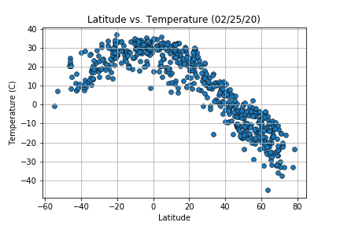
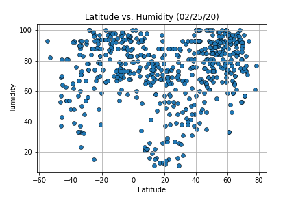
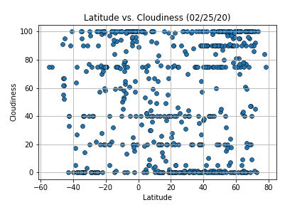
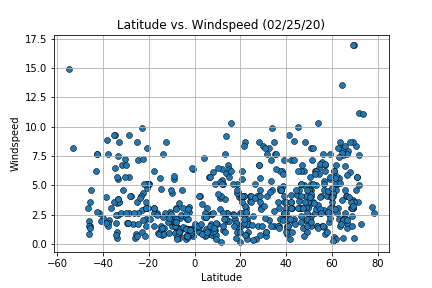

# OpenWeatherMap-API-matplots

## **Objective:**
The objective of this project is to analyze how the weather changes as you approach the equator. To complete this analysis, a list of 500 random cities was created by generating a set of random latitude and longitude combinations and identifying the nearest city for each combination using the Citipy Python library. Weather data for these cities was obtained using the OpenWeatherMap API. Matplotlib was used to plot latitude vs. maximum temperature, humidity, cloudiness, and wind speed. 

## **Tools:**
Python -  Matplotlib, Pandas, Numpy, Citipy

## **Data Source:**
OpenWeatherMap API

## **Screenshots (Graphs):**

